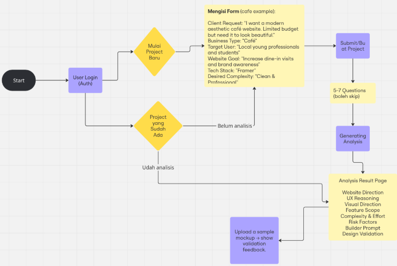

<div align="center">
  <h1>📱 AIUI Workspace</h1>
  <p>
    <strong>AI-Powered Mobile UI/UX Workspace for Designers & Developers</strong>
  </p>
  <p>
    Transform client briefs into high-definition mobile designs. Analyze requirements, generate moodboards, and validate mobile app concepts in a single unified canvas.
  </p>

  <-u postgres psql -d ppdb -f Badges -->
  <p>
    
    
    
    
    
  </p>
</div>
---



---

## Fitur Utama

- **Project Discovery:** Kumpulkan dan pahami kebutuhan klien (brief) secara mendalam lewat antarmuka form yang intuitif.
- **AI Analysis:** AI secara otomatis menganalisis kompleksitas teknis, kebutuhan backend, fitur aplikasi, dan merumuskan model bisnis.
- **Moodboard Generation:** Hasilkan aset visual dan referensi desain secara instan berdasarkan kebutuhan teknis dan target audiens proyek.
- **Unified Canvas Workflow:** Visualisasikan seluruh analisis, moodboard, dan insight dalam satu kanvas interaktif (menggunakan React Flow).
- **Builder Prompts (Prompt Architect):** Hasilkan *prompt* khusus yang dioptimalkan untuk digunakan pada platform AI builder seperti v0, Cursor, atau Framer.

## Tech Stack

- **Framework:** [Next.js (App Router)](https://nextjs.org/)
- **Styling:** [Tailwind CSS](https://tailwindcss.com/) & [shadcn/ui](https://ui.shadcn.com/)
- **Database Backend:** [Supabase](https://supabase.com/) (Auth, Storage)
- **ORM:** [Prisma](https://www.prisma.io/)
- **AI Integrations:** [Google Gemini API](https://ai.google.dev/)
- **Interactive UI:** [React Flow](https://reactflow.dev/) (xyflow)

## 💻 Panduan Instalasi (Development)

Untuk menjalankan proyek ini secara lokal, ikuti langkah-langkah berikut:

**1. Clone repositori ini**
```bash
git clone https://github.com/username-anda/nama-repo.git
cd nama-repo
```

**2. Instalasi dependensi**
```bash
npm install
```

**3. Konfigurasi Environment Variables**
Buat file `.env` di *root* direktori proyek dan isikan variabel berikut (sesuaikan dengan API & Database Anda):

```env
# Database (Supabase)
DATABASE_URL="postgresql://[DB_USER]:[DB_PASSWORD]@[DB_HOST]:[DB_PORT]/postgres"
DIRECT_URL="postgresql://[DB_USER]:[DB_PASSWORD]@[DB_HOST]:[DB_PORT]/postgres"

# Supabase Auth / Client
NEXT_PUBLIC_SUPABASE_URL="https://[YOUR_PROJECT_REF].supabase.co"
NEXT_PUBLIC_SUPABASE_ANON_KEY="your-anon-key"

# AI Service (Google Gemini)
GEMINI_API_KEY="your-gemini-api-key"
```

**4. Migrasi Database Prisma**
```bash
npx prisma generate
npx prisma db push
```

**5. Jalankan Local Server**
```bash
npm run dev
```
Buka [http://localhost:3000](http://localhost:3000) pada browser Anda untuk melihat aplikasi yang berjalan.